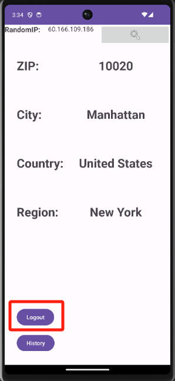

# Manual del Usuario de IP Stack
## Contenido
1. [Introducción](#introducción)
2. [Características Principales](#características-principales)
3. [Requisitos del Sistema](#requisitos-del-sistema)
4. [Instalación](#instalación)
5. [Instrucciones de Uso](#instrucciones-de-uso)
6. [Preguntas Frecuentes](#preguntas-frecuentes)
7. [Comentarios y Soporte](#comentarios-y-soporte)

## Introducción {#introduction}
¡Bienvenido a IP Stack! Esta aplicación te ofrece una forma fácil y conveniente de obtener información detallada sobre direcciones IP aleatorias. Descubre detalles como el país, ciudad, y región asociados a una dirección IP específica.

## Características Principales {#características-principales}
**-Investigación de IP Aleatoria:** Utiliza la interfaz sencilla para obtener información detallada de cualquier dirección IP aleatoria.
**-Inicio de Sesión por Correo Electrónico:** Inicia sesión con tu correo electrónico para garantizar la seguridad de tu información.
**-Historial de Investigaciones:** Visualiza el historial de direcciones IP investigadas anteriormente, facilitando el seguimiento y la comparación.
**-Diseño Sencillo y Usable:** La interfaz simple y amigable hace que la investigación de direcciones IP sea fácil y placentera.

## Requisitos del Sistema {#requisitos-del-sistema}
**Dispositivo Android:**
-compatible con Android 5.0 (Lollipop) o versiones posteriores.
-Conexión a Internet estable.

## Instalación {#instalación}
1.Descarga e instala la aplicación IP Stack desde Google Play Store o cualquier tienda de aplicaciones.
2.Abre la aplicación y sigue las indicaciones en pantalla para iniciar sesión con tu correo electrónico.

## Instrucciones de Uso {#instrucciones-de-uso}
**Inicio de Sesión:** Abre la aplicación y utiliza tu correo electrónico para iniciar sesión.

    
    
    

**Investigación de IP Aleatoria:** En la pantalla principal, haz clic en "Investigar IP Aleatoria" para obtener información detallada sobre una dirección IP aleatoria.

    
    
    

**Historial de Investigaciones:** Haz clic en "Historial" para revisar el historial de direcciones IP investigadas anteriormente.

    
    

**Logout:** Haga clic para cerrar sesión.

    
    

## Preguntas Frecuentes {#preguntas-frecuentes}
### ¿Cómo obtener más ayuda?

Si encuentras algún problema o necesitas más ayuda, consulta la documentación de ayuda dentro de la aplicación o ponte en contacto con nuestro equipo de soporte al cliente.

## Comentarios y Soporte {#comentarios-y-soporte}
Si tienes sugerencias, comentarios o preguntas, no dudes en ponerte en contacto con nuestro equipo de soporte:

-Sitio Web Oficial: https://www.ipstack.com
Agradecemos que uses IP Stack y esperamos que disfrutes utilizando esta herramienta práctica y útil para la investigación de direcciones IP.